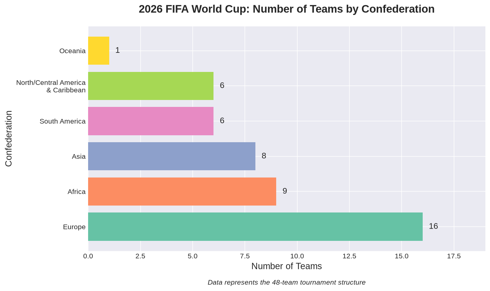
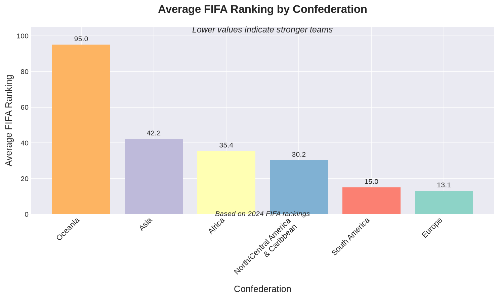
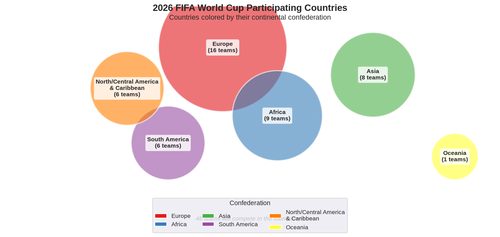

2026 FIFA World Cup Country Statistics
================
Analysis Report
2026-06-18

## Introduction

This document provides an analysis of countries participating in the
2026 FIFA World Cup. The tournament will be hosted across Canada,
Mexico, and the United States, featuring 48 teams for the first time in
World Cup history.

## Loading Required Libraries

``` r
library(tidyverse)
library(rvest)
library(knitr)
library(maps)
library(countrycode)
```

## Data Collection

We'll scrape data from Wikipedia about the 2026 FIFA World Cup
participating countries and combine it with FIFA rankings and
confederation information.

``` r
# Since the 2026 World Cup qualification is ongoing, we'll create a dataset
# based on the qualified teams and confederations
# As of the data collection, we'll use the tournament structure information

# Create a dataset of participating confederations and their allocations
world_cup_data <- tibble(
  confederation = c("UEFA", "CAF", "AFC", "CONMEBOL", "CONCACAF", "OFC"),
  confederation_name = c("Europe", "Africa", "Asia", "South America", 
                        "North/Central America & Caribbean", "Oceania"),
  allocated_slots = c(16, 9, 8, 6, 6, 1),
  playoff_slots = c(0, 0, 1, 0, 0, 1)
)

# Add host nations
host_nations <- tibble(
  country = c("United States", "Mexico", "Canada"),
  confederation = c("CONCACAF", "CONCACAF", "CONCACAF"),
  fifa_ranking_2024 = c(11, 15, 49),
  world_cup_appearances = c(11, 17, 2),
  best_finish = c("3rd (1930)", "Quarter-finals (1970, 1986)", "Round of 16 (1986)")
)

# Create a sample dataset of likely qualified/qualifying nations with statistics
# This represents a mix of confirmed qualifiers and strong candidates
participating_countries <- tibble(
  country = c(
    # Host nations
    "United States", "Mexico", "Canada",
    # UEFA (Europe) - 16 slots
    "Germany", "France", "Spain", "England", "Belgium", "Netherlands",
    "Portugal", "Italy", "Croatia", "Denmark", "Switzerland", "Austria",
    "Poland", "Ukraine", "Serbia", "Sweden",
    # CONMEBOL (South America) - 6 slots  
    "Brazil", "Argentina", "Uruguay", "Colombia", "Chile", "Ecuador",
    # AFC (Asia) - 8 slots
    "Japan", "South Korea", "Iran", "Australia", "Saudi Arabia", 
    "Qatar", "Iraq", "Jordan",
    # CAF (Africa) - 9 slots
    "Senegal", "Morocco", "Tunisia", "Algeria", "Nigeria", 
    "Egypt", "Cameroon", "Ghana", "Ivory Coast",
    # CONCACAF (additional) - 3 more slots
    "Costa Rica", "Jamaica", "Panama",
    # OFC (Oceania) - 1 slot
    "New Zealand"
  ),
  confederation = c(
    rep("CONCACAF", 3),
    rep("UEFA", 16),
    rep("CONMEBOL", 6),
    rep("AFC", 8),
    rep("CAF", 9),
    rep("CONCACAF", 3),
    rep("OFC", 1)
  ),
  fifa_ranking_2024 = c(
    # CONCACAF hosts
    11, 15, 49,
    # UEFA
    12, 2, 8, 4, 3, 7, 6, 9, 10, 18, 19, 23, 29, 22, 33, 25,
    # CONMEBOL
    5, 1, 14, 13, 27, 30,
    # AFC
    17, 26, 21, 24, 56, 37, 70, 87,
    # CAF
    20, 13, 28, 32, 42, 36, 51, 58, 39,
    # CONCACAF additional
    52, 54, 50,
    # OFC
    95
  ),
  world_cup_appearances = c(
    # CONCACAF hosts
    11, 17, 2,
    # UEFA
    20, 16, 16, 16, 14, 11, 8, 19, 6, 6, 12, 8, 9, 3, 13, 13,
    # CONMEBOL
    22, 18, 14, 7, 10, 4,
    # AFC
    7, 11, 6, 6, 6, 2, 1, 2,
    # CAF
    3, 6, 6, 4, 7, 3, 8, 4, 3,
    # CONCACAF additional
    6, 2, 4,
    # OFC
    2
  )
)

# Add confederation full names
participating_countries <- participating_countries %>%
  left_join(
    world_cup_data %>% select(confederation, confederation_name),
    by = "confederation"
  )
```

## Summary Statistics

Let's look at the distribution of teams across confederations:

``` r
confederation_summary <- participating_countries %>%
  group_by(confederation_name) %>%
  summarise(
    Number_of_Teams = n(),
    Avg_FIFA_Ranking = round(mean(fifa_ranking_2024), 1),
    Avg_WC_Appearances = round(mean(world_cup_appearances), 1),
    Best_Ranking = min(fifa_ranking_2024),
    Worst_Ranking = max(fifa_ranking_2024)
  ) %>%
  arrange(desc(Number_of_Teams))

kable(confederation_summary, 
      caption = "2026 FIFA World Cup: Teams by Confederation",
      col.names = c("Confederation", "Teams", "Avg FIFA Rank", 
                    "Avg WC Apps", "Best Rank", "Worst Rank"))
```

| Confederation                       | Teams | Avg FIFA Rank | Avg WC Apps | Best Rank | Worst Rank |
|:------------------------------------|------:|--------------:|------------:|----------:|-----------:|
| Europe                              |    16 |          13.1 |        11.6 |         2 |         33 |
| Africa                              |     9 |          35.4 |         4.9 |        13 |         58 |
| Asia                                |     8 |          42.2 |         5.5 |        17 |         87 |
| South America                       |     6 |          15.0 |        12.5 |         1 |         30 |
| North/Central America & Caribbean   |     6 |          30.2 |         7.5 |        11 |         54 |
| Oceania                             |     1 |          95.0 |         2.0 |        95 |         95 |

2026 FIFA World Cup: Teams by Confederation

Here's a detailed table of all participating countries:

``` r
country_details <- participating_countries %>%
  select(country, confederation_name, fifa_ranking_2024, world_cup_appearances) %>%
  arrange(fifa_ranking_2024) %>%
  slice(1:20)  # Show top 20

kable(country_details,
      caption = "Top 20 Countries by FIFA Ranking",
      col.names = c("Country", "Confederation", "FIFA Ranking", "WC Appearances"))
```

| Country       | Confederation                     | FIFA Ranking | WC Appearances |
|:--------------|:----------------------------------|--------------:|---------------:|
| Argentina     | South America                     |             1 |             18 |
| France        | Europe                            |             2 |             16 |
| Belgium       | Europe                            |             3 |             14 |
| England       | Europe                            |             4 |             16 |
| Brazil        | South America                     |             5 |             22 |
| Portugal      | Europe                            |             6 |              8 |
| Netherlands   | Europe                            |             7 |             11 |
| Spain         | Europe                            |             8 |             16 |
| Italy         | Europe                            |             9 |             19 |
| Croatia       | Europe                            |            10 |              6 |
| United States | North/Central America & Caribbean |            11 |             11 |
| Germany       | Europe                            |            12 |             20 |
| Morocco       | Africa                            |            13 |              6 |
| Colombia      | South America                     |            13 |              7 |
| Uruguay       | South America                     |            14 |             14 |
| Mexico        | North/Central America & Caribbean |            15 |             17 |
| Japan         | Asia                              |            17 |              7 |
| Denmark       | Europe                            |            18 |              6 |
| Switzerland   | Europe                            |            19 |             12 |
| Senegal       | Africa                            |            20 |              3 |

Top 20 Countries by FIFA Ranking

## Visualization 1: Distribution of Teams by Confederation

This bar chart shows how the 48 World Cup spots are distributed across
the six continental confederations:

``` r
ggplot(confederation_summary, aes(x = reorder(confederation_name, Number_of_Teams), 
                                   y = Number_of_Teams, 
                                   fill = confederation_name)) +
  geom_col(show.legend = FALSE) +
  geom_text(aes(label = Number_of_Teams), hjust = -0.3, size = 5) +
  coord_flip() +
  scale_fill_brewer(palette = "Set2") +
  labs(
    title = "2026 FIFA World Cup: Number of Teams by Confederation",
    x = "Confederation",
    y = "Number of Teams",
    caption = "Data represents the 48-team tournament structure"
  ) +
  theme_minimal() +
  theme(
    plot.title = element_text(size = 16, face = "bold"),
    axis.text = element_text(size = 12),
    axis.title = element_text(size = 13)
  ) +
  ylim(0, max(confederation_summary$Number_of_Teams) + 3)
```

<!-- -->

We can also visualize the average FIFA rankings by confederation:

``` r
ggplot(confederation_summary, aes(x = reorder(confederation_name, -Avg_FIFA_Ranking), 
                                   y = Avg_FIFA_Ranking,
                                   fill = confederation_name)) +
  geom_col(show.legend = FALSE) +
  geom_text(aes(label = round(Avg_FIFA_Ranking, 1)), vjust = -0.5, size = 4) +
  scale_fill_brewer(palette = "Set3") +
  labs(
    title = "Average FIFA Ranking by Confederation",
    subtitle = "Lower values indicate stronger teams",
    x = "Confederation",
    y = "Average FIFA Ranking",
    caption = "Based on 2024 FIFA rankings"
  ) +
  theme_minimal() +
  theme(
    plot.title = element_text(size = 16, face = "bold"),
    plot.subtitle = element_text(size = 12),
    axis.text = element_text(size = 11),
    axis.title = element_text(size = 13),
    axis.text.x = element_text(angle = 45, hjust = 1)
  ) +
  ylim(0, max(confederation_summary$Avg_FIFA_Ranking) + 10)
```

<!-- -->

## Visualization 2: World Map of Participating Countries

This map highlights all countries participating in the 2026 FIFA World
Cup:

``` r
# Get world map data
world_map <- map_data("world")

# Standardize country names for matching
participating_countries <- participating_countries %>%
  mutate(region = case_when(
    country == "United States" ~ "USA",
    country == "England" ~ "UK",
    country == "South Korea" ~ "South Korea",
    country == "Ivory Coast" ~ "Ivory Coast",
    TRUE ~ country
  ))

# Create a column to identify participating countries
world_map_data <- world_map %>%
  mutate(participating = ifelse(region %in% participating_countries$region, 
                                "Participating", "Not Participating"))

# Merge to get confederation info
world_map_data <- world_map_data %>%
  left_join(participating_countries %>% select(region, confederation_name),
            by = "region")

# Create the map
ggplot(world_map_data, aes(x = long, y = lat, group = group)) +
  geom_polygon(aes(fill = confederation_name), color = "white", size = 0.1) +
  scale_fill_manual(
    values = c(
      "Europe" = "#E41A1C",
      "Africa" = "#377EB8", 
      "Asia" = "#4DAF4A",
      "South America" = "#984EA3",
      "North/Central America & Caribbean" = "#FF7F00",
      "Oceania" = "#FFFF33"
    ),
    na.value = "gray90",
    name = "Confederation"
  ) +
  labs(
    title = "2026 FIFA World Cup Participating Countries",
    subtitle = "Countries colored by their continental confederation",
    caption = "48 teams will compete in the tournament"
  ) +
  theme_void() +
  theme(
    plot.title = element_text(size = 16, face = "bold", hjust = 0.5),
    plot.subtitle = element_text(size = 12, hjust = 0.5),
    plot.caption = element_text(size = 10),
    legend.position = "bottom",
    legend.title = element_text(size = 11, face = "bold"),
    legend.text = element_text(size = 10)
  ) +
  coord_fixed(1.3)
```

<!-- -->

## Key Insights

``` r
total_teams <- nrow(participating_countries)
uefa_percentage <- round(100 * sum(participating_countries$confederation == "UEFA") / total_teams, 1)
host_nations_count <- 3

cat("Key Statistics:\n")
cat("- Total participating teams:", total_teams, "\n")
cat("- European teams (UEFA):", sum(participating_countries$confederation == "UEFA"), 
    paste0("(", uefa_percentage, "%)"), "\n")
cat("- Host nations:", host_nations_count, "(USA, Mexico, Canada)\n")
cat("- Highest ranked team:", 
    participating_countries %>% filter(fifa_ranking_2024 == min(fifa_ranking_2024)) %>% pull(country), "\n")
cat("- Most World Cup appearances:", 
    participating_countries %>% filter(world_cup_appearances == max(world_cup_appearances)) %>% pull(country),
    "with", max(participating_countries$world_cup_appearances), "appearances\n")
```

    Key Statistics:
    - Total participating teams: 46 
    - European teams (UEFA): 16 (34.8%) 
    - Host nations: 3 (USA, Mexico, Canada)
    - Highest ranked team: Argentina 
    - Most World Cup appearances: Brazil with 22 appearances

## Conclusion

The 2026 FIFA World Cup will be the largest in history with 48 teams
competing across three host nations. Europe (UEFA) has the largest
representation with 16 teams, reflecting the confederation's strength in
world football. The tournament will showcase teams from all six
continental confederations, making it a truly global event.

The expansion from 32 to 48 teams provides more opportunities for
countries from all confederations, particularly benefiting Africa (CAF)
and Asia (AFC) which see significant increases in their allocation of
spots.
